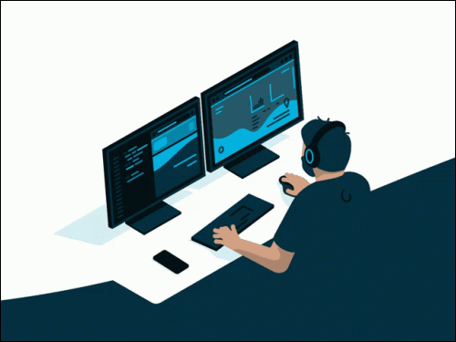

  

### Hi there 👋, I am Shah Md. Imran Hossain

 

 <ul>
    <li>💻 I’m currently working as Software Engineer(iOS)</li>
    <li>🌱 I’m currently learning about Software Architecture</li>
    <li>👯 Looking forward to collaborate on OpenSource iOS App</li>
    <li>😍 My Research Interests are: CV, NLP, LLM </li>
    <li>🔭 Looking for funded PhD program on CV, NLP, LLM</li>
    <li>📚 I love to reading novels</li>
    <li>🎮 I love to play video games</li>
    <li>😘😍💻 Happy Coding 💻😍😘</li>
 </ul>
 

 
 

<!-- Adding more blank lines -->
          

---

## 📝 Research Profile

### Research Interests

- 🤖 **Computer Vision**
- 📝 **Natural Language Processing**
- 📚 **Large Language Models**
- 🕶️ **Virtual Reality (VR)**

----

# **Computer Vision**
**[A1 Canvas](https://apps.apple.com/us/app/a1-canvas/id6452395783)**

- A computer vison model built with CreateML framework from Apple.
- This model able to detect characters from 0 to 9 and A to Z (both uppercase and lowercase)
- DataSet created by myself
- DataSet amount per character is 200
- Picture resolution: 256 * 256

---

# **Natural Language Processing**

---
